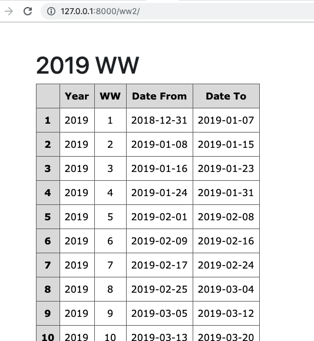

# 課後要求

- 頁面的訪問路徑是 http://127.0.0.1:8000/ww2/
- 代碼上傳到各自的  misdj-ww
- 步骤提示

  - urls 裡的 path('ww2/', views.ww2, name='ww2'),
  - views 裡的 def ww2(request):
  - templates 裡的 ww2.html
    - 日期要格式為 2019-01-09，請參考  https://docs.djangoproject.com/en/2.2/ref/templates/builtins/#std:templatefilter-date
  - templates 裡的 base.html 要加 Style 才能有美觀的表格
    - 技術配置，可參考 https://tutorial.djangogirls.org/en/css/
    - 美感調試，可參考 https://www.xul.fr/en/css/table.php

## path 請注意 要有 /，這個習慣可以省掉日後的一些麻煩。

## 發現 init 有錯誤。雖然不是故意，就是常有的事，就是逻辑錯誤。我誤算成一個星期有八天了。請找出問題，並且修護。
